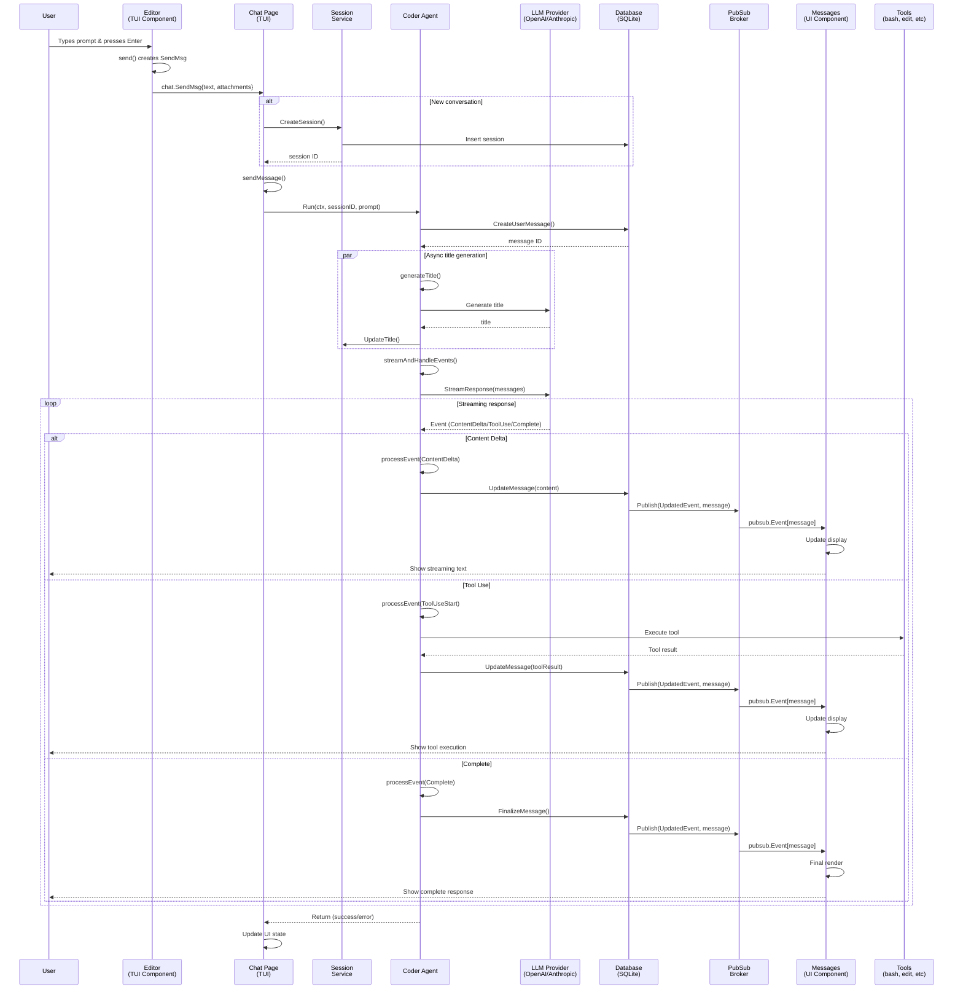

# Crush User Prompt Handling - Sequence Diagram

## Overview
This diagram illustrates how Crush handles a user prompt from input to response display.

## Sequence Diagram

## Key Components

### 1. **User Input Layer**
- **Editor Component**: Handles text input, file attachments, and keyboard shortcuts
- **Chat Page**: Manages the overall chat interface and session state

### 2. **Business Logic Layer**
- **Session Service**: Manages conversation sessions and persistence
- **Coder Agent**: Orchestrates LLM interactions, tool execution, and response handling
- **LLM Provider**: Abstraction layer supporting multiple providers (OpenAI, Anthropic, Gemini, etc.)

### 3. **Data Layer**
- **Database (SQLite)**: Persists messages, sessions, and file history
- **PubSub Broker**: Enables real-time event broadcasting across components

### 4. **Presentation Layer**
- **Messages Component**: Renders messages with syntax highlighting, animations, and tool outputs
- **TUI Framework**: Bubble Tea framework for reactive terminal UI updates

### 5. **Tool Execution**
- **Tools Package**: Implements various tools (bash, file operations, search, etc.)
- **Permission System**: Manages tool execution permissions and user confirmations

## Event Flow Details

### Message Creation & Storage
1. User message is immediately stored in database with `role: "user"`
2. Assistant message is created with `role: "assistant"` and empty content
3. Content is streamed and appended to the assistant message

### Real-time Updates via PubSub
- Every database update triggers a PubSub event
- UI components subscribe to relevant events
- Updates are rendered immediately without polling

### Tool Execution Flow
1. LLM requests tool use with parameters
2. Agent validates and executes tool
3. Tool results are stored and sent back to LLM
4. LLM incorporates results into response

### Error Handling
- Network errors trigger retry logic in providers
- Tool errors are captured and sent to LLM for recovery
- UI shows error states with appropriate messaging

## File References
- Main entry: `main.go`, `internal/cmd/root.go`
- Editor: `internal/tui/components/chat/editor/editor.go`
- Chat Page: `internal/tui/page/chat/chat.go`
- Agent: `internal/llm/agent/agent.go`
- Providers: `internal/llm/provider/*.go`
- Database: `internal/db/*.go`
- PubSub: `internal/pubsub/broker.go`
- Messages UI: `internal/tui/components/chat/messages/messages.go`
- Tools: `internal/llm/tools/*.go`