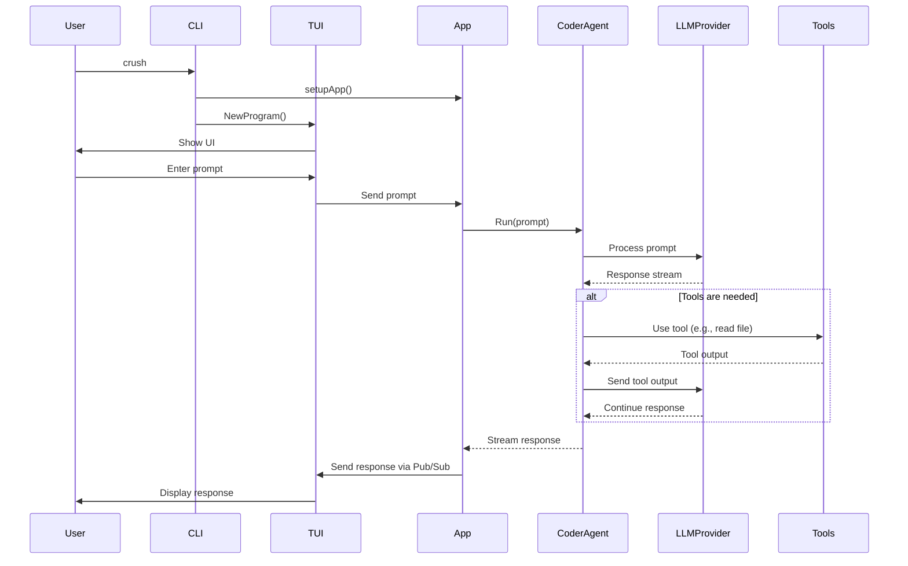

```mermaid
graph TD
    subgraph User Interface
        CLI[CLI<br>(cobra)]
        TUI[TUI<br>(bubbletea)]
    end

    subgraph Application Core
        App[app.App]
        PubSub[Pub/Sub<br>(event bus)]
    end

    subgraph Services
        SessionService[Session Service]
        MessageService[Message Service]
        HistoryService[History Service]
        PermissionService[Permission Service]
    end

    subgraph AI
        CoderAgent[Coder Agent]
        LLMProviders[LLM Providers<br>(OpenAI, Gemini, etc.)]
    end

    subgraph Tools
        LSPClients[LSP Clients]
        FileSystem[File System]
        Shell[Shell]
    end

    subgraph Data
        Database[Database<br>(sqlite)]
    end

    User -- interacts with --> CLI
    CLI -- starts --> TUI
    CLI -- or runs non-interactively --> App
    TUI -- interacts with --> App

    App -- uses --> SessionService
    App -- uses --> MessageService
    App -- uses --> HistoryService
    App -- uses --> PermissionService
    App -- uses --> CoderAgent
    App -- uses --> LSPClients

    SessionService -- uses --> Database
    MessageService -- uses --> Database
    HistoryService -- uses --> Database

    CoderAgent -- uses --> LLMProviders
    CoderAgent -- uses --> Tools

    App -- publishes/subscribes to --> PubSub
    TUI -- subscribes to --> PubSub
    Services -- publish to --> PubSub
    CoderAgent -- publishes to --> PubSub

    Tools -- interact with --> FileSystem
    Tools -- interact with --> Shell
```

## Sequence Diagram: Interactive Mode


